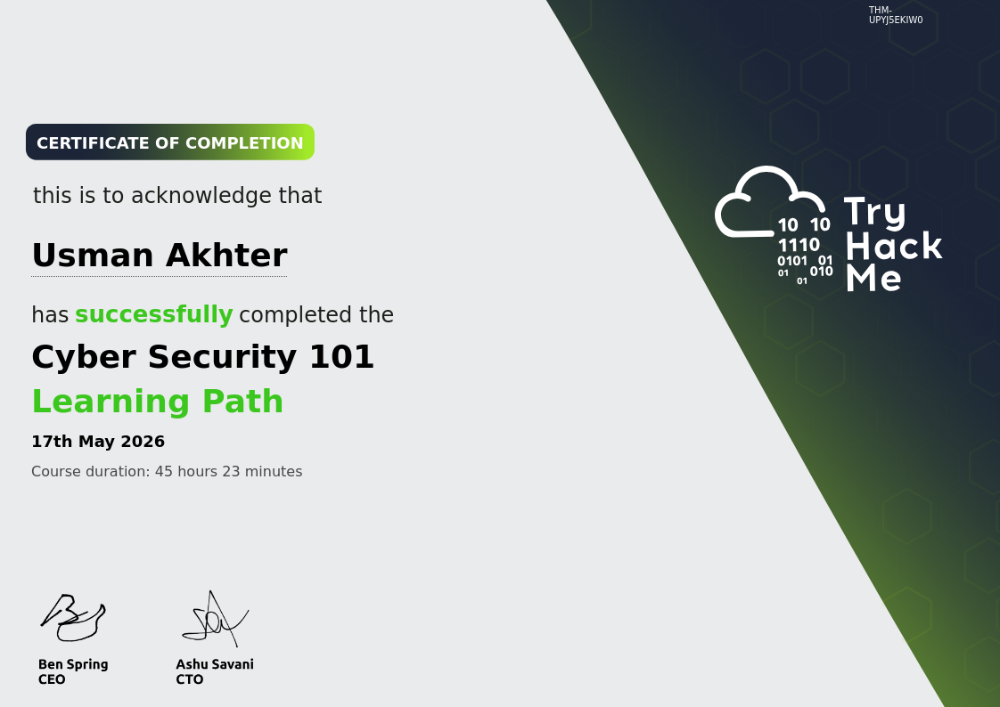

### 🏅 Certifications & Continuous Professional Development

#### **TryHackMe — Cyber Security 101**
* **Credential ID:** `THM-E6O8WJ6XOM` | **Issued:** May 2026
* **Scope:** 74 Hands-on Labs & 106 Practical Cyber Security Challenges Completed
* **Verified Certificate:** [View Official Certificate](./TryHackMe-CyberSecurity101-Usman-Akhter.png)

  

#### 🛡️ Core Technical Competencies Validated:
* **Networking & Infrastructure:** In-depth validation of the OSI model, packet sniffing basics, routing mechanics, and network architecture defense.
* **Web Application Security:** Practical exploitation and mitigation of OWASP Top 10 vulnerabilities (including XSS, SQLi, and Command Injection) within sandbox environments.
* **Linux & Windows Security:** Hands-on CLI administration, privilege structures, file permission hardening, and system authentication security.
* **Security Operations (SecOps):** Fundamental log analysis, endpoint monitoring, and incident triage methodologies.
